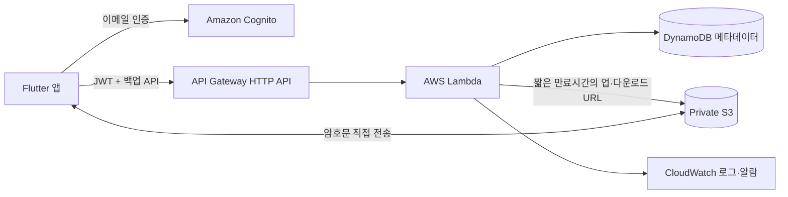

# 클라우드 백업·데이터 이사 설계 가이드

> 기준일: 2026-07-15  
> 대상: 현재 로컬 CSV 내보내기·가져오기를 안전한 클라우드 백업으로 확장하려는 단계  
> 목표: AWS 경험이 없는 상태에서 작은 MVP부터 시작하고, 이후 광고와 인앱 결제를 수용할 수 있는 구조 만들기

## 먼저 결론

이 기능은 충분히 구현할 수 있다. 다만 **“이메일과 패스키를 서버에 보내 서버가 복호화하는 구조”는 종단간 암호화가 아니다.** 추천 흐름은 다음과 같다.

1. 이메일 소유권은 Amazon Cognito의 인증 코드로 확인한다.
2. 앱이 기기 안에서 CSV를 만들고, 백업 전용 암호로 암호화한다.
3. AWS에는 복호화할 수 없는 `.csv.enc` 파일만 업로드한다.
4. 새 기기는 같은 계정으로 로그인해 암호문을 내려받는다.
5. 새 기기 안에서 사용자가 입력한 백업 암호로 복호화하고 데이터를 복원한다.

초기 규모에서는 24시간 실행되는 Flask 서버나 EC2가 필요하지 않다. **API Gateway + Lambda + Cognito + S3 + DynamoDB** 조합의 서버리스 백엔드가 더 적합하다. 서버 패치, 프로세스 관리, 오토스케일링을 직접 운영하지 않아도 되고 사용량이 작을 때 비용도 통제하기 쉽다.

Python은 사용할 수 있지만 Flask 애플리케이션부터 만들 필요는 없다. 작은 Lambda handler들로 시작하고, API가 복잡해지거나 장시간 작업·관리자 웹·WebSocket 등이 필요해질 때 FastAPI/Flask와 App Runner 또는 ECS Fargate를 검토하는 편이 좋다.

## 1. 현재 구현에서 반드시 알아야 할 점

현재 `DataImExportService`의 파일은 **암호화된 CSV가 아니다.** 다음 값으로 서명을 만들어 CSV 본문에 넣을 뿐이다.

```text
SHA-256(email | passkey | "household_ledger_v1_salt")
```

현재 방식의 성질은 다음과 같다.

- 금액, 설명, 메모, 이름, 나이, 예산, 이메일이 평문으로 보인다.
- 서명은 파일이 특정 이메일·패스키 조합으로 만들어졌는지만 확인한다.
- 고정 salt와 빠른 SHA-256을 사용하므로 파일을 얻은 공격자가 패스키 후보를 오프라인에서 대입할 수 있다.
- 서명값은 비밀키 기반 MAC이 아니므로 안전한 암호화나 강한 무결성 보호를 대신하지 못한다.
- 현재 UI에서 말하는 “본인 확인”은 실제 이메일 소유권 확인이 아니다. 임의의 이메일 문자열도 입력할 수 있다.

따라서 기존 형식은 `legacy CSV v2` 호환용으로만 유지하고, 클라우드 백업은 새로운 `encrypted backup v1` 형식으로 분리하는 것이 안전하다.

## 2. 용어부터 분리하기

현재 앱의 “패스키”는 사용자가 입력하는 문자열 암호다. 보안 표준에서 말하는 passkey(WebAuthn/FIDO 자격 증명)와는 다른 개념이므로 이름을 바꾸는 것이 좋다.

| 목적 | 추천 명칭 | 역할 |
|---|---|---|
| 계정 인증 | 이메일 인증 코드 또는 실제 passkey | 어떤 사용자의 저장 공간인지 확인 |
| 백업 복호화 | 백업 암호 / 암호화 암호 | 파일을 암·복호화하며 서버에 보내지 않음 |
| 비상 복구 | 복구 키 | 백업 암호 분실에 대비해 사용자가 별도 보관 |

이메일 주소를 암호화 키의 재료로 사용하지 않는 것을 권장한다. 이메일은 변경될 수 있고 대소문자·정규화 문제도 있으며 일반적으로 비밀이 아니다. 계정 소유자는 Cognito의 변경되지 않는 사용자 식별자 `sub`로 구분하고, 암호화 키는 백업 암호와 파일별 무작위 salt로 만든다.

## 3. 추천 아키텍처



### 서비스별 책임

| 서비스 | 책임 | 저장하면 안 되는 것 |
|---|---|---|
| Cognito User Pool | 회원가입, 이메일 검증, 로그인, JWT 발급 | 백업 암호 |
| API Gateway HTTP API | HTTPS 진입점, Cognito JWT 검증, throttling | 파일 본문 |
| Lambda | 사용자별 접근 확인, presigned URL 발급, 목록·삭제·쿼터·결제 검증 | 평문 CSV, 복호화 키 |
| S3 private bucket | `.csv.enc` 암호문 저장 | 공개 ACL, 평문 CSV |
| DynamoDB | 백업 메타데이터와 향후 결제 entitlement | 백업 암호, 평문 가계 데이터 |
| CloudWatch | 오류·지표·알람 | JWT, presigned URL, 이메일 원문, 암호·파일 내용 |

앱이 API Gateway에 큰 파일을 보내 Lambda가 다시 S3로 전달하게 하지 않는다. Lambda는 짧게 유효한 presigned URL만 발급하고, 앱은 그 URL로 S3와 직접 통신한다. 이 방식은 Lambda payload 제한과 불필요한 전송 비용을 피한다.

### S3 object 경로

```text
users/{cognito-sub}/backups/{backup-id}.csv.enc
```

- 이메일을 object key에 넣지 않는다.
- 클라이언트가 보낸 `userId`를 신뢰하지 않는다.
- Lambda는 검증된 JWT의 `sub`에서 경로를 만든다.
- `backup-id`는 UUID처럼 추측하기 어려운 값을 사용한다.
- 개발·스테이징·운영 bucket과 Cognito User Pool을 분리한다.

## 4. 진짜 종단간 암호화 설계

### 4.1 암호화 과정

```text
로컬 데이터 snapshot
  → CSV 직렬화
  → 선택적으로 gzip 압축
  → 파일별 random salt 생성
  → 백업 암호를 Argon2id로 처리해 256-bit key 생성
  → random nonce 생성
  → AES-256-GCM으로 암호화
  → versioned envelope 생성
  → .csv.enc 업로드
```

추천 원칙은 다음과 같다.

- 비밀번호 기반 키 파생에는 Argon2id처럼 메모리 비용을 갖는 KDF를 사용한다.
- KDF의 salt는 파일마다 안전한 난수로 새로 만든다. salt는 비밀이 아니며 header에 저장할 수 있다.
- 암호화는 인증 암호인 AES-256-GCM을 사용해 기밀성과 변조 탐지를 함께 제공한다.
- nonce는 같은 키에서 절대 재사용하지 않는다.
- header의 중요 필드는 AAD(Additional Authenticated Data)에 포함해 변조를 탐지한다.
- 직접 암호 알고리즘을 구현하지 말고, 유지보수되는 검증된 Dart 라이브러리를 선택한다.
- Argon2id 파라미터는 저사양 Android 실제 기기에서 benchmark한 뒤 정한다. 보안 수치를 임의로 낮추지 말고 파일 header에 파라미터를 기록해 미래에 상향할 수 있게 한다.
- 평문, 파생 키, 백업 암호를 로그에 남기지 않고 사용 직후 가능한 범위에서 메모리 참조를 해제한다.

### 4.2 파일 envelope 예시

실제 구현은 바이너리 format이나 CBOR를 권장하지만, 개념은 다음과 같다.

```json
{
  "magic": "HLBK",
  "envelopeVersion": 1,
  "dataSchemaVersion": 3,
  "compression": "gzip",
  "kdf": {
    "name": "argon2id",
    "salt": "base64...",
    "memoryKiB": "versioned-parameter",
    "iterations": "versioned-parameter",
    "parallelism": "versioned-parameter"
  },
  "cipher": {
    "name": "aes-256-gcm",
    "nonce": "base64..."
  },
  "ciphertext": "binary...",
  "authenticationTag": "binary..."
}
```

`envelopeVersion`은 암호 형식, `dataSchemaVersion`은 CSV 내부 schema를 뜻한다. 둘을 분리해야 암호 알고리즘과 데이터 migration을 독립적으로 변경할 수 있다.

### 4.3 백업 암호 분실 정책

서버가 키를 모르는 진짜 E2EE에서는 사용자가 백업 암호를 잃으면 운영자도 복구할 수 없다. 이것은 버그가 아니라 보안 모델의 결과다.

MVP에서는 다음 중 하나를 명확히 선택한다.

1. **완전한 E2EE:** 암호 분실 시 복구 불가. 가장 단순하고 안전하다.
2. **복구 키 제공:** 앱이 높은 엔트로피의 복구 키를 생성하고 사용자가 인쇄·비밀번호 관리자 등에 별도 보관한다.
3. **서버 복구 가능:** 서버 측 복구 키 escrow를 둔다. 편리하지만 운영자가 복호화 가능하므로 “서버도 볼 수 없는 E2EE” 약속을 할 수 없다.

초기 버전에는 1번 또는 2번을 권장한다. “이메일 비밀번호 재설정”과 “기존 백업 복호화”를 같은 것으로 안내하면 안 된다.

## 5. 업로드와 복원 흐름

### 5.1 업로드

1. 사용자가 이메일 인증 코드로 Cognito에 로그인한다.
2. 앱이 일관된 시점의 로컬 DB snapshot을 만든다.
3. 앱이 CSV를 직렬화하고 기기 안에서 암호화한다.
4. 앱이 `POST /v1/backups/upload-url`을 JWT와 함께 호출한다.
5. Lambda가 사용자 쿼터, 파일 크기 제한, entitlement를 확인하고 presigned URL을 발급한다.
6. 앱이 암호문을 S3에 직접 업로드한다.
7. 앱이 `POST /v1/backups/{id}/complete`를 호출한다.
8. Lambda가 S3의 크기와 암호문 checksum을 확인하고 DynamoDB 상태를 `READY`로 바꾼다.

업로드 URL은 짧은 시간만 유효하게 하고 object key, content type, checksum, 최대 크기를 제한한다. presigned POST의 `content-length-range` 정책을 사용하거나, presigned PUT 후 `HeadObject` 검증에 실패한 object를 즉시 삭제한다.

### 5.2 복원

1. 새 기기에서 같은 Cognito 계정으로 로그인한다.
2. `GET /v1/backups`로 자신의 백업 목록을 조회한다.
3. 백업을 선택하고 `POST /v1/backups/{id}/download-url`을 호출한다.
4. `.csv.enc`를 앱 임시 폴더로 내려받는다.
5. 백업 암호를 입력해 **기기 안에서** 복호화한다.
6. GCM 인증, envelope version, CSV schema와 모든 row를 먼저 검증한다.
7. 현재 데이터를 자동 백업하거나 사용자에게 덮어쓰기 경고를 보여준다.
8. DB transaction 안에서 전체 복원을 수행한다.
9. 성공한 뒤에만 기존 상태를 교체하고 임시 평문 파일을 삭제한다.

틀린 암호, 변조 파일, 네트워크 중단, schema 오류가 발생해도 기존 로컬 데이터가 바뀌지 않아야 한다.

## 6. 최소 API 설계

| Method | Path | 역할 |
|---|---|---|
| `POST` | `/v1/backups/upload-url` | 업로드 ID와 presigned URL 발급 |
| `POST` | `/v1/backups/{id}/complete` | 업로드 검증 및 목록에 공개 |
| `GET` | `/v1/backups` | 로그인 사용자의 백업 목록 |
| `POST` | `/v1/backups/{id}/download-url` | 소유권 확인 후 다운로드 URL 발급 |
| `DELETE` | `/v1/backups/{id}` | object와 metadata 삭제 |
| `DELETE` | `/v1/account` | 계정, 모든 object version, metadata, entitlement 삭제 |
| `GET` | `/v1/entitlements` | 무료/유료 기능 권한 조회 |
| `POST` | `/v1/billing/google/verify` | 향후 Google Play 구매 token 검증 |

응답에는 내부 S3 bucket 이름이나 장기 AWS 자격 증명을 노출하지 않는다. 모든 변경 API는 재시도해도 결과가 중복되지 않도록 idempotency를 고려한다.

### DynamoDB 예시

```text
PK = USER#{cognito-sub}
SK = BACKUP#{backup-id}
status = UPLOADING | READY | DELETING
objectKey
encryptedSize
ciphertextSha256
envelopeVersion
dataSchemaVersion
createdAt
expiresAt (선택)
```

결제 권한은 같은 table의 `SK = ENTITLEMENT#GOOGLE_PLAY`처럼 둘 수도 있지만, 백업 metadata와 lifecycle이 달라지면 별도 table로 분리한다. 이메일은 표시 목적이 꼭 필요할 때만 Cognito에서 다루고 backup row의 주 식별자로 쓰지 않는다.

## 7. AWS를 처음 시작할 때의 순서

### 단계 A — 비용과 계정 안전장치부터

- [ ] AWS root 계정에 MFA를 설정하고 일상 작업에 root를 사용하지 않는다.
- [ ] 개인 IAM 사용자 장기 access key 대신 IAM Identity Center/단기 자격 증명을 사용한다.
- [ ] AWS Budgets 경고와 Cost Anomaly Detection 알림을 먼저 설정한다.
- [ ] 모든 resource에 `project`, `environment`, `owner` tag를 붙인다.
- [ ] 초기 region을 하나 선택한다. 한국·일본 사용자 중심이면 Tokyo(`ap-northeast-1`)를 우선 검토하되 개인정보 국외 이전과 서비스 가용성을 확인한다.

무료 사용량 구간은 계정과 서비스 시점에 따라 달라질 수 있으므로 “무료일 것”을 전제로 설계하지 않는다. 비용은 S3 저장·요청·전송, API Gateway 호출, Lambda 실행, DynamoDB, Cognito MAU/메시지, CloudWatch 로그에서 발생한다.

### 단계 B — 별도 backend 저장소 만들기

Flutter 저장소와 배포 주기·비밀정보·권한이 다르므로 별도 프로젝트를 권장한다.

```text
household-ledger-backend/
  template.yaml              # AWS SAM infrastructure as code
  src/
    backups/
      create_upload.py
      complete_upload.py
      list_backups.py
      create_download.py
      delete_backup.py
    account/
      delete_account.py
    billing/
      verify_google.py
      handle_rtdn.py
    common/
      auth.py
      responses.py
      settings.py
  tests/
  events/
  samconfig.toml
  README.md
```

Python Lambda와 AWS SAM을 추천한다. `template.yaml` 한 곳에서 API Gateway, Lambda, IAM, S3, DynamoDB, Cognito와 환경별 설정을 코드로 관리한다. 콘솔에서 클릭으로 만든 운영 resource는 재현과 review가 어렵다.

학습용으로 AWS 콘솔에서 Hello World를 한 번 만들어 보는 것은 괜찮지만, 실제 dev 환경부터는 SAM으로 배포한다.

```powershell
sam init
sam build
sam local start-api
sam deploy --guided
```

### 단계 C — 암호화만 먼저 로컬 prototype

AWS를 붙이기 전에 Flutter에서 다음을 완성한다.

- [ ] `EncryptedBackupCodec` 같은 독립 service 작성
- [ ] CSV bytes → encrypt → decrypt → 원본 bytes 일치 test
- [ ] 잘못된 암호와 1-byte 변조가 반드시 실패하는 test
- [ ] envelope/schema version test
- [ ] 저사양 Android에서 KDF 시간·메모리 benchmark
- [ ] 기존 `.csv` 수동 내보내기·가져오기 유지

암호화와 네트워크를 동시에 개발하면 오류 원인을 구분하기 어렵다. 로컬 `.csv.enc` 내보내기와 가져오기가 먼저 완성되어야 한다.

### 단계 D — AWS dev 환경 MVP

- [ ] Cognito 이메일 가입·검증·로그인
- [ ] private S3 bucket과 Block Public Access 네 항목 활성화
- [ ] API Gateway Cognito JWT authorizer
- [ ] upload/download presigned URL Lambda
- [ ] DynamoDB backup 목록
- [ ] CloudWatch 구조화 로그와 오류 알람
- [ ] 사용자당 백업 개수·개별 파일 크기·총 저장량 제한
- [ ] S3 lifecycle과 미완료 upload 정리

초기 제한 예시는 “백업 5개, 개별 20MB, presigned URL 5분”처럼 작게 시작하되 실제 데이터 크기 측정 후 정한다. 제한값은 코드 곳곳에 박지 말고 환경 설정과 상품 entitlement로 관리한다.

### 단계 E — 운영 전 보안·복구 검증

- [ ] API별 최소 IAM 권한 적용
- [ ] S3 object owner와 JWT `sub` 일치 여부 test
- [ ] 다른 사용자의 ID를 바꿔 호출하는 IDOR test
- [ ] 로그에 token, presigned URL, 이메일, 암호가 없는지 확인
- [ ] rate limit과 비정상 반복 요청 대응
- [ ] S3 기본 server-side encryption 활성화
- [ ] S3 Versioning 사용 여부와 lifecycle 비용 검토
- [ ] 계정 삭제 시 delete marker만 남기지 않고 모든 object version이 실제 삭제되는지 test
- [ ] 장애 중 업로드, 중복 complete, 동시 삭제 test
- [ ] dev data를 production에 복사하지 않기

S3 server-side encryption은 AWS 저장매체 보호를 위한 추가 방어선이다. 클라이언트 E2EE를 대체하지 않으며 AWS KMS를 사용해도 서버가 복호화 가능한 구조라면 그것만으로 E2EE가 되지 않는다.

## 8. Flask가 필요한가?

### 지금은 필요하지 않은 이유

- endpoint 수가 작고 요청이 짧다.
- 파일 본문은 S3로 직접 전송하므로 web server가 streaming할 필요가 없다.
- Lambda가 유휴 시간에는 실행되지 않아 작은 서비스 운영에 맞다.
- API Gateway가 TLS endpoint와 JWT 검증을 담당한다.
- EC2/컨테이너의 OS patch, process restart, capacity를 관리할 필요가 없다.

Lambda 안에 Flask를 adapter로 얹는 것도 가능하지만, 초기에는 framework overhead와 배포 복잡성만 늘 수 있다. Python 함수와 공통 module, request/response schema validator 정도면 충분하다.

### Flask/FastAPI 또는 컨테이너를 검토할 시점

- 장시간 실행되는 작업이 많아 Lambda 실행 모델과 맞지 않을 때
- 큰 파일을 지속적으로 streaming해야 할 때
- 항상 살아 있는 connection이나 복잡한 관리자 web이 필요할 때
- 다수 route와 middleware 때문에 단일 web application이 더 단순해질 때
- 팀이 이미 WSGI/ASGI 운영과 container 배포에 익숙할 때

그때는 Python web app을 App Runner 또는 ECS Fargate에 배포할 수 있다. 지금부터 domain logic을 Lambda event 객체와 분리해 두면 이동하기 쉽다.

## 9. 광고와 인앱 결제를 고려한 확장

### Google 광고

AdMob 광고 표시는 일반적으로 이 백업 backend가 없어도 가능하다. 다만 다음 작업은 필요하다.

- 광고 SDK가 수집하는 데이터를 Data safety와 개인정보처리방침에 반영
- 대상 지역에 맞는 동의 관리(예: Google UMP) 검토
- 광고 제거 상품이 생기면 서버의 entitlement와 앱의 광고 표시 정책 연결
- 개발·테스트 과정에서 실제 광고 클릭 금지 및 test ad unit 사용

광고용 식별자와 백업 암호, 가계 데이터, Cognito 계정을 불필요하게 결합하지 않는다.

### Google Play 인앱 결제

유료 클라우드 용량, 광고 제거, 자동 백업을 판매한다면 secure backend가 필요하다.

1. 앱이 Play Billing으로 구매를 진행한다.
2. 앱은 purchase token을 backend에 전송한다.
3. backend가 Google Play Developer API로 token을 검증한다.
4. `PURCHASED` 상태와 상품을 확인한 뒤 DynamoDB entitlement를 갱신한다.
5. Lambda가 presigned URL 발급 전에 entitlement와 quota를 확인한다.
6. 구독 갱신·취소·환불은 Real-time Developer Notifications(RTDN)로 반영한다.

클라이언트가 보내는 `isPremium=true`나 로컬 SharedPreferences만 믿고 권한을 부여하면 안 된다. token 검증, acknowledge, 중복 token 처리, 환불·취소 처리는 서버에서 idempotent하게 수행한다.

RTDN은 Google Cloud Pub/Sub을 사용한다. AWS 중심이어도 작은 GCP project가 필요하며, Pub/Sub push subscription이 인증된 AWS API Gateway endpoint를 호출하게 만들거나 GCP의 작은 relay를 둘 수 있다. 알림은 상태 변경 신호일 뿐이므로 수신 후 Google Play Developer API에서 완전한 구매 상태를 다시 조회한다.

### 상품 설계 예시

| 등급 | 가능한 정책 예시 |
|---|---|
| 무료 | 수동 클라우드 백업 1~3개, 제한된 보관 기간 |
| 광고 지원 | 무료 기능 유지, 비민감 화면에만 광고 |
| 프리미엄 | 광고 제거, 더 많은 백업, 자동 백업, 장기 보관 |

사용자 금융 기록 자체를 광고 targeting에 사용하지 않는 것을 강하게 권장한다. 기능 권한과 저장량 제한은 backend가 최종 판정하되, 복호화는 언제나 client에서 수행한다.

## 10. 개인정보·Play 정책 변화

클라우드 기능을 추가하면 현재의 “개발자 서버로 데이터 전송 없음” 전제가 바뀐다. 암호문이라도 다음 metadata는 서비스에 전달된다.

- 계정 이메일과 Cognito 사용자 ID
- IP, 요청 시각, 기기/app 관련 최소 로그
- 백업 파일 크기, 생성 시각, object ID
- 결제 시 purchase token과 entitlement 정보

출시 전에 다음을 갱신한다.

- [ ] Google Play Data safety
- [ ] 개인정보처리방침: 수집 항목, 목적, AWS/Google 처리, region, 보관 기간, 파기
- [ ] 앱 내 명확한 클라우드 백업 동의와 E2EE/복구 불가 안내
- [ ] 앱 내부와 외부 web에서 계정 삭제 요청 제공
- [ ] 계정 삭제 시 Cognito, DynamoDB, S3 모든 version, 결제 연결 정보 삭제 절차
- [ ] 일본·한국 및 실제 배포 국가의 개인정보 국외 이전·처리 요건 검토

“서버는 가계부 내용을 볼 수 없다”고 표현할 수는 있지만, 암호화 구현과 로그 정책이 실제로 그 약속을 보장해야 한다. 서버가 보는 metadata까지 아무것도 수집하지 않는다고 표현하면 안 된다.

## 11. 테스트 계획

### 암호화

- 동일 입력도 salt/nonce가 달라 매번 다른 암호문 생성
- 올바른 암호만 복호화 성공
- ciphertext, header, tag 중 1-byte만 바뀌어도 실패
- 한국어·일본어·줄바꿈·큰 금액·쉼표가 왕복 후 동일
- 오래된 envelope/schema를 새 앱에서 migration
- 암호나 평문이 crash log에 포함되지 않음

### API와 권한

- 미인증 요청은 401
- 사용자 A가 사용자 B의 백업을 목록·다운로드·삭제할 수 없음
- 만료된 presigned URL은 실패
- 크기 초과, checksum 불일치, 중복 complete 처리
- upload 중 앱 종료 시 미완료 object 자동 정리
- 삭제된 계정으로 token 재사용 불가

### 복원 안전성

- 복호화 실패 시 기존 DB 무변경
- CSV 일부 row 손상 시 전체 복원 중단 또는 명확한 정책 적용
- transaction 중 앱 종료 후 DB 일관성 유지
- 복원 전 자동 local snapshot 또는 명시적 확인
- 동일 백업을 반복 복원했을 때 중복/덮어쓰기 정책 일관성

### 결제

- pending 구매에는 entitlement 미부여
- 동일 purchase token 재전송에 중복 지급 없음
- 취소·환불·구독 만료 반영
- RTDN 중복 message 처리
- Google API 장애 시 안전한 재시도와 임시 상태 유지

## 12. 권장 개발 로드맵

| 단계 | 결과물 | 예상 학습·개발 초점 |
|---|---|---|
| 1 | 로컬 `.csv.enc` 생성·복원 | E2EE format, crypto test, atomic import |
| 2 | AWS dev 계정·SAM Hello World | IAM, budget, CloudFormation/SAM, 로그 |
| 3 | Cognito 로그인 | 이메일 검증, JWT, 로그인/탈퇴 UX |
| 4 | S3 presigned upload/download | private storage, quota, checksum, 실패 복구 |
| 5 | DynamoDB 목록·삭제 | 사용자 소유권, lifecycle, 계정 삭제 |
| 6 | closed beta | 여러 기기, 네트워크 중단, 보안·비용 관찰 |
| 7 | 결제 도입 시 entitlement backend | Play Developer API, RTDN, 환불·취소 |
| 8 | 광고 도입 시 정책 갱신 | 동의, Data safety, 광고 제거 entitlement |

처음부터 자동 동기화까지 구현하지 않는다. **“사용자가 눌러 암호화 백업 1개 업로드 → 다른 기기에서 선택 복원”**을 첫 성공 기준으로 삼는 것이 좋다. 이 과정이 안정된 뒤 backup 목록, 자동 백업, 보관 정책, 유료 용량을 순서대로 추가한다.

## 13. Codex의 견해

이 앱에는 클라우드 백업이 잘 맞는다. 로컬 파일을 사용자가 직접 보관하는 방식은 투명하고 서버 비용도 없지만, 실제 데이터 이사 과정에서 파일을 잃거나 어디에 저장했는지 모르는 문제가 자주 생길 수 있다. 특히 가계 데이터는 복구 실패의 체감 피해가 크다.

다만 “클라우드 동기화”보다 “암호화된 클라우드 금고”로 정의하는 편이 현재 앱의 성격에 맞다. 서버가 거래 row를 이해하거나 병합하지 않고, 버전이 있는 암호문 snapshot을 보관하는 것이다. 이 접근은 개인정보 위험과 backend 복잡성을 크게 줄이면서도 기기 이동 UX를 개선한다.

제가 권하는 선택은 다음과 같다.

- Flask/EC2부터 시작하지 않는다.
- Flutter의 로컬 암호화 codec을 가장 먼저 만든다.
- 로그인 암호와 백업 암호를 분리한다.
- AWS에는 private S3 암호문과 최소 metadata만 둔다.
- 별도 Python + AWS SAM backend 저장소를 만든다.
- 수동 백업 MVP를 먼저 출시한 뒤 자동 동기화는 나중에 판단한다.
- 광고보다 백업 안정성과 결제 entitlement 설계를 먼저 완성한다.

가장 큰 기술 위험은 AWS 자체가 아니라 **암호화 키 복구 UX, 데이터 복원 원자성, 계정 삭제, 기존 CSV 호환성**이다. 이 네 가지를 초기에 문서와 test로 고정하면 이후 AWS 서비스 선택은 비교적 쉽게 바꿀 수 있다.

## 공식 참고자료

- [Amazon Cognito 인증 방식과 이메일 OTP](https://docs.aws.amazon.com/cognito/latest/developerguide/amazon-cognito-user-pools-authentication-flow-methods.html)
- [Cognito 이메일 설정](https://docs.aws.amazon.com/cognito/latest/developerguide/user-pool-email.html)
- [API Gateway HTTP API JWT authorizer](https://docs.aws.amazon.com/apigateway/latest/developerguide/http-api-jwt-authorizer.html)
- [S3 presigned URL 업로드](https://docs.aws.amazon.com/AmazonS3/latest/userguide/PresignedUrlUploadObject.html)
- [S3 Block Public Access](https://docs.aws.amazon.com/AmazonS3/latest/userguide/access-control-block-public-access.html)
- [S3 Versioning](https://docs.aws.amazon.com/AmazonS3/latest/userguide/Versioning.html)
- [S3 Lifecycle](https://docs.aws.amazon.com/AmazonS3/latest/userguide/intro-lifecycle-rules.html)
- [AWS SAM 시작 가이드](https://docs.aws.amazon.com/serverless-application-model/latest/developerguide/serverless-getting-started-hello-world.html)
- [AWS Lambda와 Fargate 선택 가이드](https://docs.aws.amazon.com/decision-guides/latest/fargate-or-lambda/fargate-or-lambda.html)
- [AWS Serverless 보안 원칙](https://docs.aws.amazon.com/wellarchitected/latest/serverless-applications-lens/security-pillar.html)
- [AWS Cost Anomaly Detection](https://docs.aws.amazon.com/cost-management/latest/userguide/getting-started-ad.html)
- [Argon2 RFC 9106](https://www.rfc-editor.org/rfc/rfc9106)
- [Google Play Billing backend 통합](https://developer.android.com/google/play/billing/backend)
- [Google Play Billing lifecycle과 RTDN](https://developer.android.com/google/play/billing/lifecycle)
- [Google Play 구매 token 검증](https://developer.android.com/google/play/billing/developer-payload)

